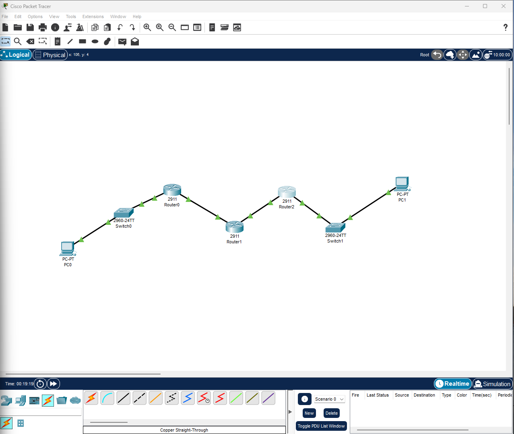
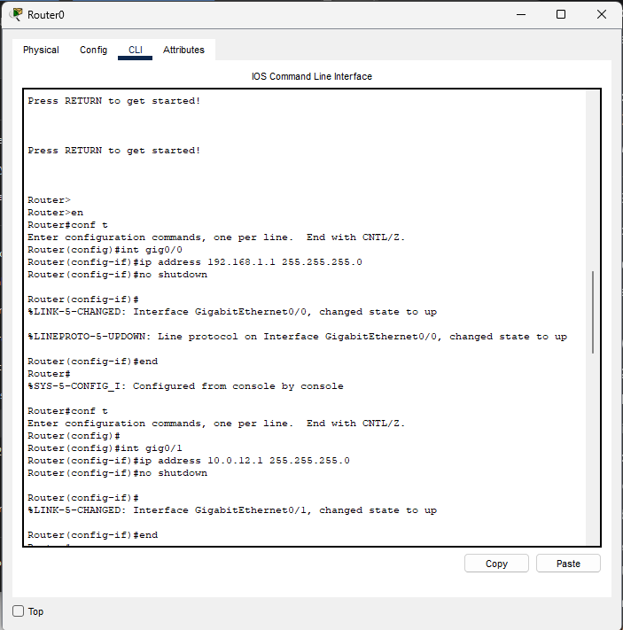
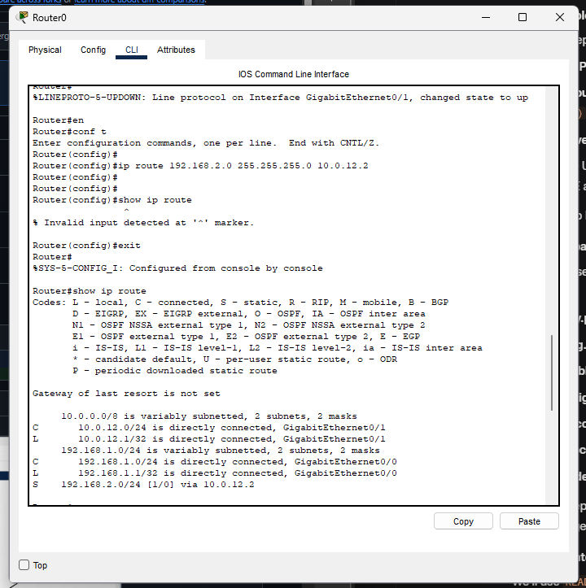
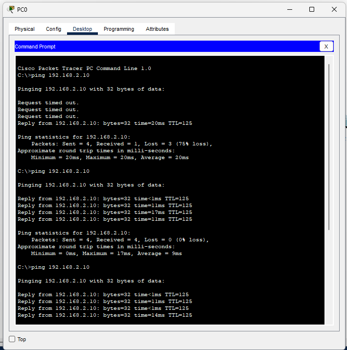
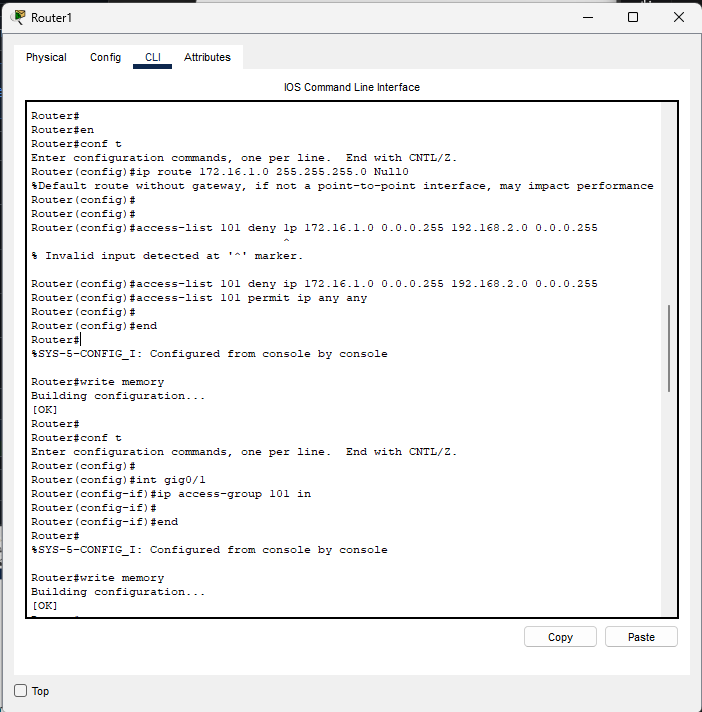
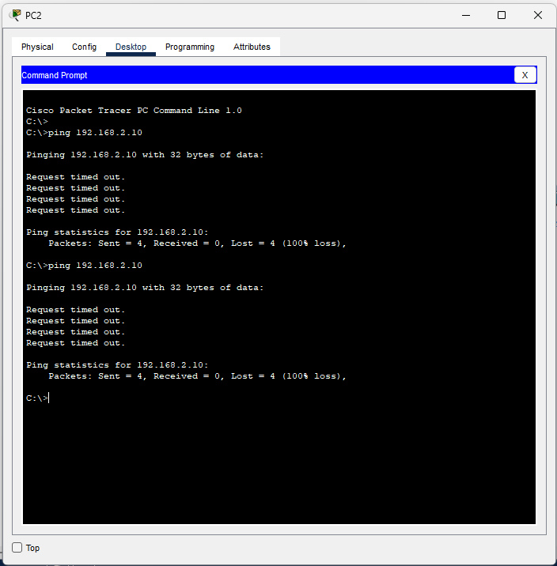
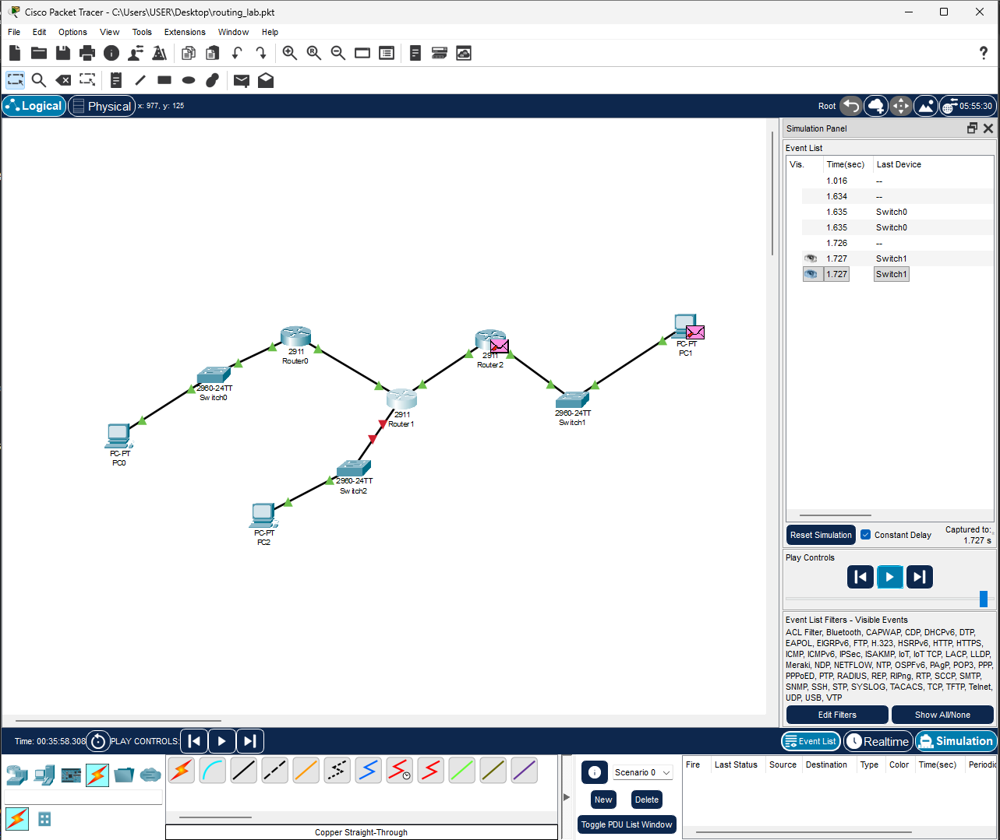

# IP Routing Fundamentals & ACL Security in Cisco Packet Tracer

*Network Topology: 3-router setup with OSPF for dynamic routing. (Screenshot from Packet Tracer)*

As a cybersecurity researcher, mastering IP Routing is essential—attackers exploit misrouted traffic for pivots. This lab builds a multi-site network, configures static/dynamic routing, then secures it with Access Control Lists (ACLs) to block unauthorized subnets. 

**Lab Time:** 1-2 hours  
**Tools:** Cisco Packet Tracer (free download from Cisco Networking Academy)  
**Security Focus:** Prevent lateral movement via route filtering.  
**Download:** [routing_lab.pkt](labs/routing_lab.pkt) (Upload your .pkt file to a `labs/` folder for sharing.)

## Key Concepts
- **IP Routing:** Directs packets between subnets using routing tables (static: manual; dynamic: protocols like OSPF).
- **ACLs:** Firewall-like filters on routers—permit/deny based on IP, protocol, ports.
- **Cyber Tie-In:** Blocks spoofed traffic from rogue subnets (e.g., 172.16.1.0/24).

| Component | Purpose | Security Risk if Misconfigured |
|-----------|---------|--------------------------------|
| Static Routing | Simple paths | No auto-updates; leaks via recon (e.g., Nmap). |
| OSPF | Dynamic updates | Route poisoning attacks. |
| Extended ACL | Granular blocking | Implicit deny can lock out legit users. |

## Hands-On Lab: Basic IP Routing

### Step 1: Build Topology
1. Open Packet Tracer > New project.
2. Drag: 3x 2911 Routers (Router0, Router1, Router2), 2x PCs (PC0, PC1), 2x Switches.
3. Connect: PC0 → Switch0 → Router0 Gig0/0; Router0 Gig0/1 → Router1 Gig0/0; Router1 Gig0/1 → Router2 Gig0/0; Router2 Gig0/1 → Switch1 → PC1.
   - Use Copper Straight-Through cables.

*Your built network—ensure all links are green.*

### Step 2: Assign IP Addresses
Click devices > CLI or Config tab.

**PC0:** IP: 192.168.1.10/24, Gateway: 192.168.1.1  
**Router0:**  

(Repeat for others: Router1 Gig0/0: 10.0.12.2/30, Gig0/1: 10.0.23.2/30; Router2: 10.0.23.3/30, Gig0/1: 192.168.2.1/24; PC1: 192.168.2.10/24, Gateway: 192.168.2.1.)

*CLI output for Router0 interfaces.*

### Step 3: Static Routing
On each router (CLI: `enable` > `conf t`):

**Router0:** `ip route 192.168.2.0 255.255.255.0 10.0.12.2`  
**Router1:** `ip route 192.168.1.0 255.255.255.0 10.0.12.1` & `ip route 192.168.2.0 255.255.255.0 10.0.23.3`  
**Router2:** `ip route 192.168.1.0 255.255.255.0 10.0.23.2`  

Test: PC0 > Desktop > Command Prompt: `ping 192.168.2.10` (Success?).

*`show ip route` on Router0—note 'S' for static.*

### Step 4: Switch to Dynamic OSPF
Clear statics: `no ip route ...`  
All routers:  

Re-ping PC0 to PC1. `show ip route` shows 'O' for OSPF.

*Inter-site ping working via dynamic routes.*

## Enhancing Security: Adding ACLs to Block Unauthorized Subnets

Protect Site B (192.168.2.0/24) from rogue subnet (172.16.1.0/24) on Router1.

### Step 1: Add Rogue Test Device
Drag PC2 + Switch2. Connect to Router1 (or sim IP: 172.16.1.10/24). Add temp route: `ip route 172.16.1.0 255.255.255.0 Null0`.

### Step 2: Configure Extended ACL on Router1

*Creating and applying ACL 101.*

### Step 3: Verify
- `show access-lists` (counters on deny).  
- Legit ping (PC0 to PC1): Succeeds.  
- Rogue ping (PC2 to PC1): Fails.

*Rogue ping dropped—check sim mode for red packet icon.*

*Simulation view: ACL filtering inbound traffic.*

### Troubleshooting
- Ping fails? Check ACL direction (inbound on source interface).  
- `show ip access-lists` for hits.

## Next Steps & Cyber Insights
- **Attack Sim:** Use Kali's hping3 for DoS floods—watch ACL counters.  
- **Advanced:** Reflexive ACLs for stateful filtering.  
- **Resources:** [Cisco ACL Guide](https://www.cisco.com/c/en/us/support/docs/ip/access-lists/13608-21.html).  

*Lab by [Your Name] | Updated Oct 2025 | [View on GitHub](https://github.com/yourusername/cyber-labs)*

---

**Questions?** Fork this repo and experiment!
